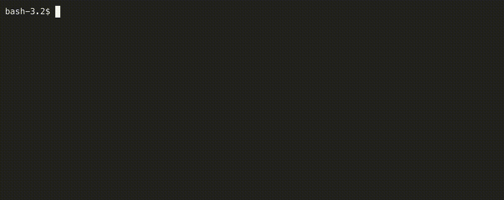

# Deo

Automating [handbrake](https://handbrake.fr/) to work with [mkv-renamer](https://github.com/ssanj/mkv-renamer)


## What does it do?


Deo is built to work in tandem with mkv-renamer. While mkv-renamer renames mkv-encoded files into a given directory structure, deo takes files in that structure and gives the user an option of selecting which files to encode. After the selections have been made, deo invokes handbrake with the supplied files and encoding profile to convert them into mp4 files.




## How does it do it?

mkv-renamer works with a processing directory (PD) with the following structure:

```
<PD>
  |- Rips
      | sesson1
        |- disc1
        |- disc2
        |- disc3
        ..
        |- discN
        |- renames
      | sesson2
        |- disc1
        |- disc2
        |- disc3
        ..
        |- discN
        |- renames
      ..
      | sessonN
        |- disc1
        |- disc2
        |- disc3
        ..
        |- discn
        |- renames
  |- Encodes
```

mkv-renamer moves renamed files into a `renames` directory under a given `session` directory and also creates the TV series name and season under the `Encodes` directory. For example:

```
├── Encodes
│   └── Monk {tvdb-78490}
│       ├── Season 01
│          ├── S02E01 - Mr. Monk and the Dentist.mp4
│          └── S02E02 - Mr. Monk and the Fire.mp4
└── Rips
    └── session1
        ├── renames
        │   ├── S02E01 - Mr. Monk and the Dentist.mkv
        │   ├── encode_dir.txt
        │   └── S02E02 - Mr. Monk and the Fire.mkv
        ├── disc1
        ├── disc2
        ├── disc4
        └── disc3
```

Deo inspects the mkv files in each session's `renames` directory, along with the matching the contents of the `encode_dir.txt`, which has the target `Encodes` directory these files should be encoded to. Deo then lists matched files with your handbrake profiles. Your handbrake profiles should be created under `~/.deo/profiles`. The handbrake profiles can be exported from the handbrake UI in `json` format.

If Deo can't match all of the above conditions it will not list your files for encoding. You can run Deo with the `--verbose` flag to get more information about what's going on.

<details>
<summary>Verbose Logging</summary>

Verbose logging will explain how matching files are chosen and what has been skipped.


</details>

## Usage

View usage with `deo -h`:

```
Automating handbrake to work with mkv-renamer

Usage: deo [OPTIONS] --source <SOURCE>

Options:
  -s, --source <SOURCE>  Source directory that contains Rips/sessionX/renames and Encodes
      --verbose          Verbose debug logging
  -h, --help             Print help (see more with '--help')
  -V, --version          Print version
```


## Installation

### Downloading a Release

Download the latest [release](https://github.com/ssanj/deo/releases) for your operating system (Linux or macOSX).
Make it executable with:

`chmod +x <DEO_EXEC>`

Copy executable to a directory on your path.


### Building through Cargo

You can build Deo through Cargo with:

```
cargo install --git https://github.com/ssanj/deo
```

This will install Deo into your Cargo home directory; usually `~/.cargo/bin`.

### Building from Source

Ensure you have Cargo installed.

Run:

```
cargo build --release
Copy binary file from target/release/deo to a directory on your PATH.
```

